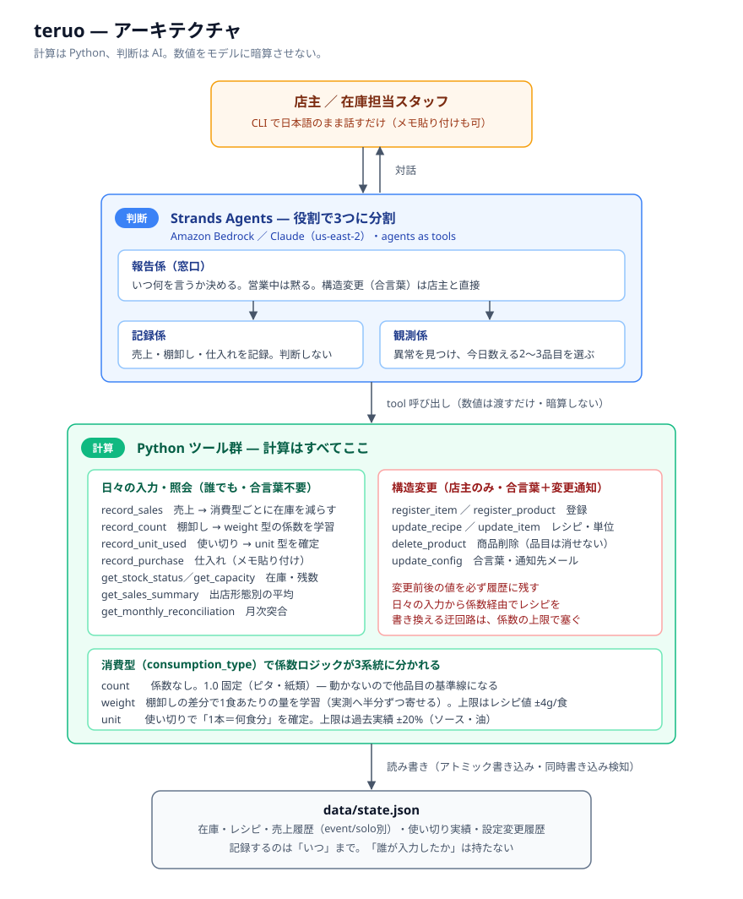
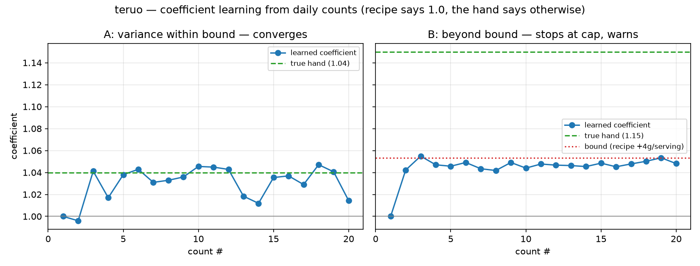

# teruo

キッチンカー・屋台のための在庫管理エージェント。
名前は英語の tell から。計算はさせず、動かない。教えるだけ。

売上からレシピ経由で在庫を減らし、棚卸しや使い切りの実測から消費係数を
学習して直し続ける対話型CLIです。

## なぜ作ったか

キッチンカーの在庫は帳簿どおりに減らない。トングで盛る肉は人によって一皿の量が違い、
レシピの75gは実際には80gにも90gにもなる。だから理論値を信じず、実測で
消費係数を学習して直し続ける設計にした。

もうひとつは報告のタイミング。営業中のピークにアラートを出されても手が離せず対応できない。
対応できない情報は邪魔でしかない。判断ができる唯一の時間は開店前で、営業中は事実だけを
短く言い、判断は求めない。この「現場の時間の使い方」に合わせることを設計の中心に置いた。

「学習中です」と言い続けるのも禁じた。棚卸し5回または2週間で打ち切り、それでも
安定しないなら言い訳ではなく原因の候補を報告する。

## 数え方は品目ごとに違う

在庫をすべて g で管理するのは現場に合わない。ソースは業務用の1本で入り、中身が何gかは
誰も測っていない。玉ねぎは「1個で何食分」が決まっている。つまり「20g × 何食」ではなく
**「1本で何食もつか」が現場の数え方**になる。

そこで消費の数え方を3つに分け、係数ロジックを分岐させた。

| consumption_type | 例 | 係数が表すもの | 学習のしかた |
|---|---|---|---|
| `count` | ピタパン、ナプキン | — | しない（1.0 固定） |
| `weight` | 肉、ライス | 1食あたりの実消費量 | 棚卸しの差分から |
| `unit` | ソース、油、玉ねぎ | 1ユニットが何食分か | 使い切った時点で確定 |

ユニット型は途中の残量を測らない。開封中のボトルの「残り3割」は誰にも分からないからだ。
代わりに空になった瞬間だけは確実に分かるので、**確定した事実だけで学習する。**
重量型より正確で、実装も軽い。

型は品目名からは決めない。同じ玉ねぎでも、1個ずつ使う店と中子1杯を単位にする店がある。
どちらかは初回カウンセリングの「使う時は、何を1として数えますか」で決まる。

## 数字が合わない時にどうするか

係数の学習はそのまま攻撃面になる。棚卸しを少なめに申告すれば係数が上がり、以降その分の
消費が「正常」として見えなくなる。だから盛り付けのブレの物理的な上限（1食あたり±4g）を
超える補正はしない。上限に達したら学習を止め、レシピ自体の見直しが要るかもしれないと伝える。

理論値が在庫を割ってマイナスになっても、0 には丸めないしエラーでも止めない。マイナスは
「理論値が実測より多く見積もっていた」という情報で、丸めると係数を直す材料そのものが消える。
営業中に売上が打てなくなるほうが困る。数字は表示せず「実測が必要です」とだけ言う。

そして**誰が入力したかは記録しない。** 打った数字が自分の負担になると分かれば正直に
打たなくなり、係数はでたらめを学習して teruo が使えなくなる。倫理の問題であると同時に、
システムが機能するための条件でもある。

単発では閾値の内側に収まる差も、月単位の積算なら見える（2g/食 × 100食 × 25日 = 5kg）。
`get_monthly_reconciliation` が仕入れ・レシピ理論消費・棚卸し実測を突き合わせる。
ただし teruo は原因を分けられない。記録漏れも廃棄も抜き取りも同じ「理論値より少ない」として
現れる。だから犯人を指さず、事実と幅の異常だけを言う。

## 必要な環境変数

Replit Secretsへ次を登録してください。値をコードや`.env`へ書かないでください。

- `AWS_ACCESS_KEY_ID`
- `AWS_SECRET_ACCESS_KEY`
- `AWS_DEFAULT_REGION`（`us-east-2`）

## 起動

```bash
python main.py
```

- 品目・商品が未登録（空の `data/state.json`）の場合は初回カウンセリングが始まります
- `python main.py --setup` でカウンセリングを強制的にやり直せます
- 終了するには `exit` または `quit` と入力します

## ファイルを渡す

プロンプトの行にファイル名を打つだけです。前後に文章があっても構いません:

```
> これうちのメニュー  menu_photo.png
> 棚卸し表.xlsx
> "納品書 3月3日.pdf" が今朝届いた
```

写真（`png` `jpg` `gif` `webp`）と文書（`xlsx` `xls` `csv` `pdf` `docx`
`doc` `html` `txt` `md`）は、モデルが直接読みます。ローカルでは解析しないので、
表計算ライブラリは使いません。パスにスペースが入っていても、引用符の有無を問わず
読めます。

teruo は読み取った内容を必ず見せ、承認をもらうまで記録しません。読み違えた値段は
その場で捕まえます。1週間後の在庫の数字になってからでは遅いためです。1行につき
5ファイルまで（写真は約3.7MB、文書は約4.5MBまで）。

**リンクは読みません。** 外部アクセスは設計上持ちません（指示書 付録A）。
スクレイピングも、地図・レビューサイトのAPIも使いません。ページを写真か
ファイルとして保存して渡してください。

## 言語

既定は英語です。プロンプト・ツール出力・CLI をすべて日本語にするには、初回だけ
`--lang ja` を付けて起動してください:

```bash
python main.py --lang ja
```

選んだ言語は `data/state.json` の `config.language` に保存されるので、2回目以降は
指定不要です。環境変数 `TERUO_LANG=ja` でも指定できます。
`data/state.ja.json` は同じデモ店を日本語の品目名・助数詞（枚 / 本 / 個）で
登録したものです:

```bash
INVENTORY_STATE_PATH=data/state.ja.json python main.py
```

画面に出る文言は `i18n.py` に英日を並べて置いてあり、計算コードは共通です。
設計書・指示書は日本語が正で、英訳を `docs/*.en.md` に併置しています。

## ファイル

- `main.py`: 対話ループ（通常モード / カウンセリングモード）、言語の選択
- `agents.py`: 判断層のエージェント3役（報告係・記録係・観測係）。プロンプトは英日両方
- `attachments.py`: プロンプトに打たれたファイル名を画像・文書ブロックに変換する
- `tools.py`: 計算ツール群（記録・登録・照会）
- `i18n.py`: 画面に出る文言の英日対訳表
- `store.py`: `data/state.json`の読み書き（アトミック書き込み・同時書き込み検知）
- `data/state.json`: 在庫、レシピ、履歴、設定（`data/state.ja.json`: 日本語のデモ店）
- `tests/simulate_convergence.py`: 係数収束の検証シミュレーション

## アーキテクチャ



計算(在庫減算・係数学習)はすべて Python ツール側で行い、AI は判断だけを担います。
判断層は設計書にある3つの判断に沿って3エージェントに分かれています
(Strands の agents-as-tools 構成):

- **報告係（窓口）**: いつ何を言うか決める。営業中は黙る。構造変更(合言葉)は店主と直接
- **記録係**: 売上・棚卸し・仕入れを受けて Python ツールで記録する。判断しない
- **観測係**: 異常を見つけ、今日数えてもらう品目を2〜3つに絞る

## 係数は本当に収束するのか

中核の主張「手の誤差を学習する」を、真の係数を決めた20営業日分の
機械生成データで検証しています(`python tests/simulate_convergence.py`)。



- 盛りブレが上限(レシピ±4g/食)の内側なら、棚卸し3〜5回で真の値に収束する
  (5回目以降の平均は真の値との差0.6%)
- 上限を超えるブレは上限で学習が止まり、レシピ見直しの警告になる(原則12)
- 1食1枚の紙類(count型)の係数は 1.0 から動かない
- 実測1回を全量採用すると日々のブレ(±5%)を追いかけて振動したため、
  更新式は実測へ半分ずつ寄せる平滑化を入れている(検証で判明し、設計書に反映)

## 設計指針

正本は `docs/teruo-design.md`（設計書B）。

- 計算は Python、判断は AI。数値をモデルに暗算させない
- 理論値は仮置き、実測（棚卸し・使い切り）で直す
- 係数には物理的な上限を置く。日々の入力がレシピを実質的に書き換える迂回路を塞ぐ
- 構造変更（レシピ・単位・品目構成）は合言葉を要求し、変更前後の値を履歴に残す
- 消さない。品目は `active: false` で隠すだけ、履歴は追記のみ

## ライセンス

MIT License（`LICENSE` を参照）。
[Strands Agents SDK](https://github.com/strands-agents/sdk-python)（Apache 2.0）を使用しています。
