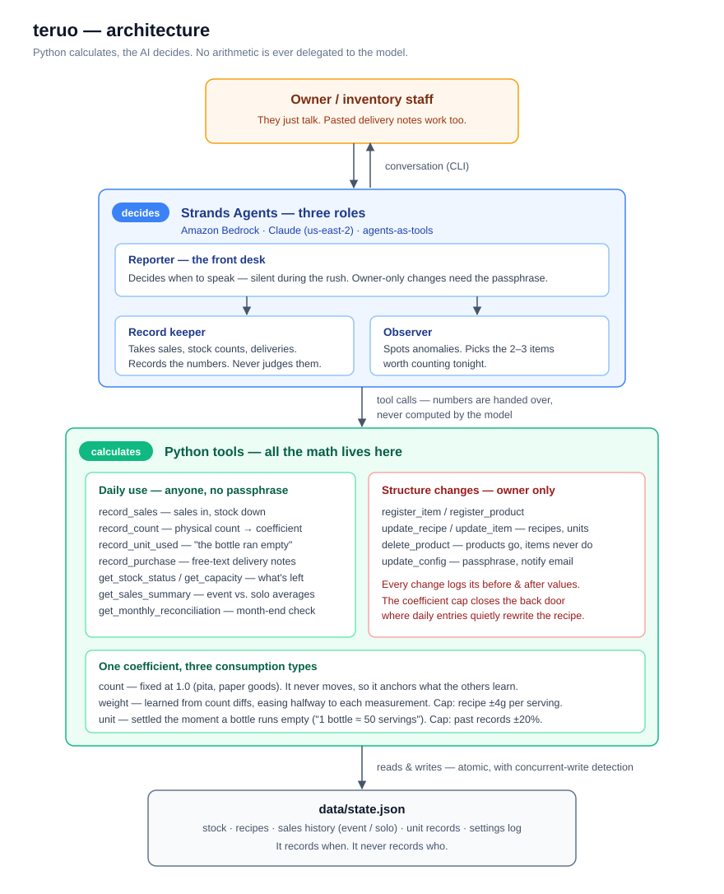

# teruo

キッチンカー・屋台のための在庫管理エージェント。
名前は英語の tell から。計算はさせず、動かない。教えるだけ。

売上からレシピ経由でTier 1品目の在庫を減らし、棚卸しの実測差分から
消費係数を補正する対話型CLIです。

## なぜ作ったか

キッチンカーの在庫は帳簿どおりに減らない。トングで盛る肉は人によって一皿の量が違い、
レシピの75gは実際には80gにも90gにもなる。だから理論値を信じず、棚卸しの実測で
消費係数を学習して直し続ける設計にした。

もうひとつは報告のタイミング。営業中のピークにアラートを出されても手が離せず対応できない。
対応できない情報は邪魔でしかない。判断ができる唯一の時間は開店前で、営業中は事実だけを
短く言い、判断は求めない。この「現場の時間の使い方」に合わせることを設計の中心に置いた。

「学習中です」と言い続けるのも禁じた。棚卸し5回または2週間で打ち切り、それでも
安定しないなら言い訳ではなく原因の候補を報告する。

## 必要な環境変数

Replit Secretsへ次を登録してください。値をコードや`.env`へ書かないでください。

- `AWS_ACCESS_KEY_ID`
- `AWS_SECRET_ACCESS_KEY`

通常の環境変数:

- `AWS_DEFAULT_REGION=us-east-2`

## 起動

```bash
python main.py
```

- 品目・商品が未登録（空の `data/state.json`）の場合は初回カウンセリングが始まります
- `python main.py --setup` でカウンセリングを強制的にやり直せます
- 終了するには `exit` または `quit` と入力します

## ファイル

- `main.py`: Strandsエージェントと対話ループ（通常モード / カウンセリングモード）
- `tools.py`: 計算ツール群（記録・登録・照会）
- `store.py`: `data/state.json`の読み書き（アトミック書き込み・同時書き込み検知）
- `data/state.json`: 在庫、レシピ、履歴、設定

## アーキテクチャ



計算（在庫減算・係数学習）はすべて Python ツール側で行い、AI は
「何を数えてもらうか」「異常かどうか」「いつ報告するか」の判断だけを担います。

## 設計指針

正本は `docs/teruo-design.md`（設計書B）。

- 計算は Python、判断は AI。数値をモデルに暗算させない
- 理論値は仮置き、実測（棚卸し）で直す
- 構造変更（レシピ・単位・品目構成）は合言葉を要求し、変更履歴を残す

## ライセンス

MIT License（`LICENSE` を参照）。
[Strands Agents SDK](https://github.com/strands-agents/sdk-python)（Apache 2.0）を使用しています。
